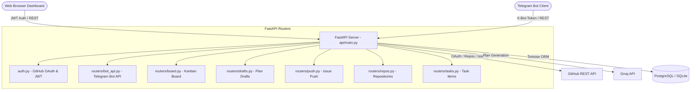

# FastAPI Backend & Web Dashboard (`api/`)

This directory contains the central **FastAPI REST API server** and **Web Dashboard** for LogicalFire (Project Manager Bot). It manages database persistence via Tortoise ORM, handles GitHub OAuth authentication, executes AI project plan generation, coordinates GitHub issue synchronization, and serves the Web dashboard interface.

---

## 🏗️ Backend Architecture



---

## 🔒 Security & Authentication

The API implements a dual-layer security model:

1. **Telegram Bot Authorization (`verify_bot_token`)**:
   Endpoints under `/api/bot/*` require the custom HTTP header `X-Bot-Token` matching `BOT_API_SECRET` from environment variables.
2. **Web OAuth & JWT (`HTTPBearer`)**:
   Users authenticate via GitHub OAuth (`/auth/github/login`). Upon success, a signed JWT token (`HS256`) is issued for Web UI session management.

---

## 📂 File & Router Structure

### 1. [main.py](main.py) - Server Configuration
* **Lifespan Manager**: Initializes Tortoise ORM schemas using `core.db_config.TORTOISE_ORM` on startup and gracefully closes connections on shutdown.
* **Middleware**: Configures `CORSMiddleware` for full cross-origin resource sharing.
* **Static File Mount**: Serves Web UI files from `api/static/` at `/static` and `/`.
* **API Overview**: Exposes `/api/info` and `/health` endpoints.

### 2. [auth.py](auth.py) - GitHub OAuth & User Token Management
* `GET /auth/github/login`: Redirects user to GitHub OAuth consent page.
* `GET /auth/github/callback`: Handles GitHub authorization callback, exchanges code for access token, updates `User` model, and issues JWT token.
* `POST /auth/github/token`: Login/Register using an existing GitHub token.
* `GET /auth/me`: Returns profile and active repository for currently logged-in user.

### 3. [routers/bot_api.py](routers/bot_api.py) - Bot Proxy Routes
Dedicated endpoints supporting `bot/api_client.py`:
* `POST /api/bot/identify`: Verifies user registration by `telegram_id`.
* `POST /api/bot/login-link`: Generates OAuth link for Telegram chat.
* `POST /api/bot/repos` & `/select_repo`: Fetches and changes user active repository.
* `POST /api/bot/plan`: Invokes Groq LLM plan generation or revision.
* `POST /api/bot/push`: Pushes draft to GitHub issues.
* `POST /api/bot/create_task`: Single or bulk-parsed checklist task creation.
* `POST /api/bot/board/*`: Task locking, claims, releases, and completion.

### 4. Domain REST Routers
* **[routers/board.py](routers/board.py)**: Web endpoints to retrieve board status (`GET /api/board`), claim tasks, release locks, and mark tasks done.
* **[routers/drafts.py](routers/drafts.py)**: CRUD endpoints for project plan drafts.
* **[routers/push.py](routers/push.py)**: Endpoints to push drafts directly to GitHub.
* **[routers/repos.py](routers/repos.py)**: List user's write-accessible GitHub repositories.
* **[routers/tasks.py](routers/tasks.py)**: Single task creation and bulk task checklist parser.

### 5. Web UI ([static/](static/))
* `index.html`: Responsive HTML5 Single Page Application featuring dashboard overview, plan generator form, and interactive Kanban board.
* `style.css`: Modern glassmorphism CSS design system with CSS custom properties and smooth transitions.
* `script.js`: Frontend logic for GitHub authentication, draft saving, and real-time board interaction.

---

## ⚡ Running the API Server

Launch the development server with auto-reload:

```bash
uv run uvicorn api.main:app --host 0.0.0.0 --port 8000 --reload
```

* **Interactive OpenAPI Documentation**: `http://localhost:8000/docs`
* **ReDoc Specifications**: `http://localhost:8000/redoc`
* **Web UI Dashboard**: `http://localhost:8000/`
