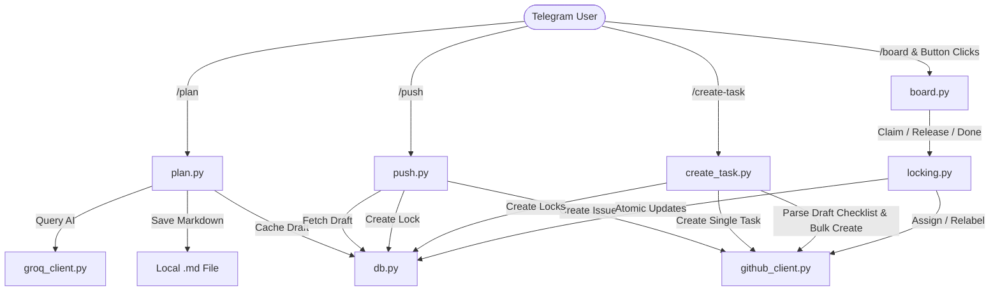

# Bot Implementation Walkthrough

This directory contains the core implementation of the Telegram ➜ GitHub Project Manager Bot. Below is a detailed walkthrough of each module, command, helper function, and state transition.

---

## 🏗️ Core Architecture & Data Flow

---

## 📂 Modules & Function Walkthrough

### 1. [models.py](models.py) - Pydantic Data Structures
Provides Pydantic models for type safety, validation, and representation when moving rows out of SQLite.
*   **`Draft`**: Represents a project plan draft before it is pushed.
    *   `id`: SQLite primary key.
    *   `chat_id`: Telegram chat ID.
    *   `user_id`: Telegram creator ID.
    *   `content`: Full markdown document body.
    *   `created_at`: Datetime stamp of draft generation.
*   **`Lock`**: Represents the claim and lifecycle state of a GitHub issue.
    *   `issue_number`: GitHub issue number (Primary Key).
    *   `repo`: GitHub repository name.
    *   `locked_by_user_id`: Telegram user ID of claimant.
    *   `locked_by_username`: Telegram username of claimant.
    *   `locked_at`: Timestamp when task was claimed.
    *   `status`: Current column (`todo` / `doing` / `done`).

### 2. [db.py](db.py) - SQLite Session & CRUD
Manages SQLite operations. Connections are handled via a context manager to ensure sockets are closed and prevent memory leaks.
*   **`db_session()`**: A context manager that opens a connection, yields it, commits on success, rolls back on error, and ensures the connection is closed.
*   **`init_db()`**: Sets up SQLite tables.
*   **`save_draft(chat_id, user_id, content)`**: Inserts a new draft plan for a user.
*   **`get_latest_draft(chat_id, user_id)`**: Fetches the user's most recent draft.
*   **`get_all_user_drafts(chat_id, user_id)`**: Fetches all pending drafts for a user.
*   **`get_draft_by_id(draft_id)`**: Fetches a specific draft by its ID.
*   **`delete_draft_by_id(draft_id)`**: Deletes a draft after it is successfully pushed.
*   **`claim_lock_in_db(issue_number, user_id, username)`**: Atomically updates a task's status to `doing` if it is unclaimed or in `todo` status, returning a boolean indicating success.
*   **`release_lock_in_db(issue_number, user_id)`**: Frees a card back to `todo` status if the matching claimant requests it.
*   **`force_release_lock_in_db(issue_number)`**: Forcefully releases a lock (used for admin override and background lock expirations).
*   **`mark_lock_done_in_db(issue_number, user_id)`**: Transitions a task's status to `done` if claimed by the requesting user.

### 3. [groq_client.py](groq_client.py) - Groq completions Client
Interfaces with the Groq API using `httpx`.
*   **`format_idea_to_markdown(raw_idea, use_reasoning)`**:
    *   Formats the raw prompt text.
    *   Sends a structured system prompt forcing a unified project structure (Title, Problem, Solution, Tech Stack, Milestones, Open Questions).
    *   If `use_reasoning=True`, queries the larger `GROQ_MODEL_REASONING` model; otherwise, uses `GROQ_MODEL_SMALL` to save cost.

### 4. [github_client.py](github_client.py) - GitHub API Wrapper
Interacts with the GitHub Issues REST API.
*   **`create_github_issue(title, body)`**: Creates a new GitHub issue and applies the label `status:todo`.
*   **`list_github_issues()`**: Fetches open issues in the repository.
*   **`assign_and_relabel_issue(issue_number, github_username, status_label)`**:
    *   Fetches the current issue to retain existing labels while removing older `status:*` labels.
    *   Patches the issue with the new status label and assignee.
    *   **Resiliency Fallback**: If the assignee update fails (e.g. user is not a repository contributor), it catches the `422` error and retries the PATCH request, updating only the status labels.

### 5. [locking.py](locking.py) - State Coordination
Contains the core state machine coordinating database changes with GitHub updates.
*   **`claim_card(issue_number, user_id, username)`**:
    *   Checks if the issue is already claimed or completed.
    *   Attempts an atomic DB claim.
    *   If successful, requests the GitHub client to assign the user and relabel the issue to `status:doing`.
*   **`release_card(issue_number, user_id, is_admin)`**:
    *   Verifies if the requester is the claimant or an administrator.
    *   Clears the lock in the DB and removes the assignee/re-labels the issue to `status:todo` on GitHub.
*   **`mark_card_done(issue_number, user_id)`**:
    *   Verifies the claimant and sets the lock status to `done` in the DB.
    *   Updates the GitHub issue label to `status:done` (retaining the assignee for attribution).
*   **`expire_stale_locks()`**:
    *   Scans for locks in `doing` status older than `LOCK_TIMEOUT_HOURS`.
    *   Forcefully unlocks them and updates the corresponding GitHub issues.

### 6. [auth.py](auth.py) - User Verification & Decorators
Manages authorization checks.
*   **`is_user_admin(update, context)`**:
    *   Validates user permissions.
    *   Returns `True` if the user's ID is in the `ADMIN_USER_IDS` environment variable.
    *   Returns `True` if the chat is a Group/Channel and the user has Creator or Administrator privileges.
*   **`admin_only(func)`**: A decorator that wraps command functions. Blocks execution and replies with a `⛔ Access Denied` message if the caller is not an administrator.

---

## 💬 Command handlers (`/commands/`)

### 1. [commands/plan.py](commands/plan.py)
*   **`sanitize_filename(title)`**: Sanitizes the project title to generate a valid filename slug (e.g. `my-project-plan`).
*   **`plan_command(update, context)`**:
    *   Restricted to administrators via `@admin_only`.
    *   Accepts raw ideas, queries Groq, saves the draft to the database, writes the markdown plan to a local file in the workspace, and returns the markdown in a copy-friendly text block.

### 2. [commands/push.py](commands/push.py)
*   **`push_command(update, context)`**:
    *   Restricted to administrators via `@admin_only`.
    *   Retrieves all of the user's pending drafts. If there's only one, it automatically parses the title and body, creates the GitHub issue, registers a lock in the DB, and clears the draft.
    *   If there are multiple drafts, it presents an **Interactive Inline Keyboard** allowing the user to select which specific draft to push.
*   **`push_callback_handler(update, context)`**:
    *   Handles button clicks from the inline keyboard, verifying admin permissions and dynamically pushing the selected draft.

### 3. [commands/create_task.py](commands/create_task.py)
*   **`parse_tasks_from_markdown(markdown_content)`**: Uses regular expressions to parse tasks from checklist items (lines starting with `- [ ]`, `* [ ]`, or `+ [ ]`).
*   **`create_task_command(update, context)`**:
    *   Restricted to administrators via `@admin_only`.
    *   If arguments are present, creates a single task issue and SQLite lock.
    *   If no arguments are present, retrieves the latest draft, parses all task checklist items, bulk-creates them as GitHub issues and database locks, and returns a summary message.

### 4. [commands/board.py](commands/board.py)
*   **`get_board_data()`**: Fetches open issues from GitHub, registers default locks in SQLite for missing issues, groups issues by status, formats the Kanban board text, and compiles the interactive inline keyboard markup.
*   **`board_command(update, context)`**: Sends the formatted Kanban board and keyboard to the chat.
*   **`board_callback_handler(update, context)`**:
    *   Routes inline button clicks (`claim`, `release`, `done`, `refresh`).
    *   Updates states using `locking.py`.
    *   Allows administrators to override and release tasks claimed by other users.
    *   Edits the existing board message in-place to avoid chat clutter.
