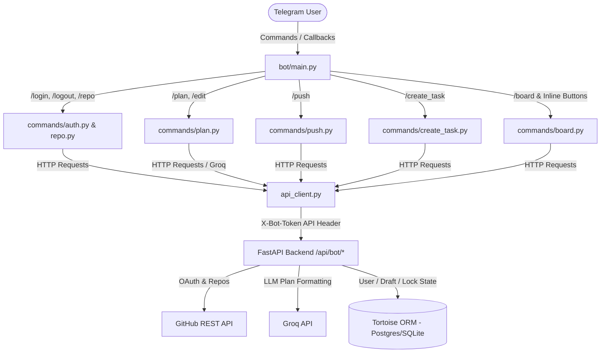

# Bot Implementation & Architecture Walkthrough

This directory contains the Telegram Bot implementation for **LogicalFire (Project Manager Bot)**. The bot acts as an asynchronous conversational client powered by `python-telegram-bot`, communicating with the FastAPI backend via `api_client.py`.

---

## 🏗️ Bot Architecture & Data Flow

```mermaid
graph TD
    User([Telegram User]) -->|Commands / Callbacks| BotMain[bot/main.py]
    
    BotMain -->|/login, /logout, /repo| AuthCmds[commands/auth.py & repo.py]
    BotMain -->|/plan, /edit| PlanCmd[commands/plan.py]
    BotMain -->|/push| PushCmd[commands/push.py]
    BotMain -->|/create_task| TaskCmd[commands/create_task.py]
    BotMain -->|/board & Inline Buttons| BoardCmd[commands/board.py]
    
    AuthCmds -->|HTTP Requests| APIClient[api_client.py]
    PlanCmd -->|HTTP Requests / Groq| APIClient
    PushCmd -->|HTTP Requests| APIClient
    TaskCmd -->|HTTP Requests| APIClient
    BoardCmd -->|HTTP Requests| APIClient
    
    APIClient -->|X-Bot-Token API Header| Backend[FastAPI Backend /api/bot/*]
    
    Backend -->|OAuth & Repos| GitHubAPI[GitHub REST API]
    Backend -->|LLM Plan Formatting| GroqAPI[Groq API]
    Backend -->|User / Draft / Lock State| DB[(Tortoise ORM - Postgres/SQLite)]
```

---

## 📂 File & Module Breakdown

### 1. [main.py](main.py) - Bot Initializer & Polling Loop
* Sets up `Application.builder()` using `TELEGRAM_BOT_TOKEN`.
* Registers command handlers (`/start`, `/login`, `/logout`, `/repo`, `/plan`, `/edit`, `/push`, `/board`, `/create_task`).
* Registers inline callback query handlers (`select_repo:`, `push_draft:`, `save_draft:`, `resend_ai:`, and board callbacks).
* Registers message handlers to catch text feedback for AI plan iteration.

### 2. [api_client.py](api_client.py) - Backend Communication Proxy
Provides async helper functions that send secure HTTP POST requests (with `X-Bot-Token` header) to the FastAPI server:
* `identify_user(telegram_id)`: Checks registration and GitHub OAuth status.
* `get_login_link(telegram_id, chat_id)`: Obtains GitHub OAuth login URL.
* `logout_user(telegram_id)`: Disassociates Telegram user's GitHub OAuth.
* `list_user_repos(telegram_id)` & `select_repo(telegram_id, repo)`: Handles repository switching.
* `generate_plan(...)`: Triggers LLM plan drafting or iterative feedback updates.
* `create_draft(...)`, `update_draft(...)`, `list_drafts(...)`: Manages user drafts.
* `push_draft(...)`: Pushes draft to GitHub issues.
* `create_task(...)`: Single or bulk-parsed task creation.
* `get_board(...)`, `claim_card(...)`, `release_card(...)`, `mark_card_done(...)`: Operates Kanban board state.

### 3. [auth.py](auth.py) - Telegram User Authorization
* `is_user_admin(update, context)`: Checks if user ID is in `ADMIN_USER_IDS` or if user has group admin status.
* `admin_only(func)`: Decorator guarding admin-restricted commands.

### 4. [groq_client.py](groq_client.py) - Groq AI Client
Direct LLM completion client using `httpx`:
* `format_idea_to_markdown(raw_idea, use_reasoning, previous_markdown, feedback)`: Constructs structured prompts for `llama-3.3-70b-versatile` / `llama-3.1-8b-instant` to generate or revise project Markdown documents.

### 5. [github_client.py](github_client.py) - GitHub Issues REST Client
Utility wrapper interacting with GitHub API:
* `create_github_issue(title, body, repo, token)`: Creates a GitHub issue with `status:todo`.
* `list_github_issues(repo, token)`: Lists open repository issues.
* `assign_and_relabel_issue(...)`: Updates task assignees and status labels (`status:todo`, `status:doing`, `status:done`). Handles fallback if assignee is not a repo collaborator.

### 6. [locking.py](locking.py) - Task Lock Coordination
Coordinates card locking business logic and timeout expiration:
* `claim_card(...)`, `release_card(...)`, `mark_card_done(...)`.
* `expire_stale_locks(...)`: Releases locks older than `LOCK_TIMEOUT_HOURS`.

### 7. [models.py](models.py) - Pydantic Schemas
Pydantic schemas for data transfer and validation (`Draft`, `Lock`).

---

## 💬 Command Handlers (`commands/`)

| File | Command | Description |
| :--- | :--- | :--- |
| [auth.py](commands/auth.py) | `/login`, `/logout` | Generates GitHub OAuth link or unlinks GitHub account. |
| [repo.py](commands/repo.py) | `/repo` | Displays inline keyboard listing write-accessible repositories for active user selection. |
| [plan.py](commands/plan.py) | `/plan`, `/edit` | Generates AI project plan draft, supports iterative chat feedback, and creates local `.md` file. |
| [push.py](commands/push.py) | `/push` | Pushes draft to GitHub as a issue labeled `status:todo`. |
| [create_task.py](commands/create_task.py) | `/create_task` | Creates single issue or bulk-parses checklist checkboxes (`- [ ]`) from draft. |
| [board.py](commands/board.py) | `/board` | Renders interactive Kanban board with inline `[Claim]`, `[Release]`, and `[Mark Done]` buttons. |

---

## 🔁 Inline Callback Flows

1. **`select_repo:<repo_name>`**: Updates active target repository for user.
2. **`save_draft:<draft_id>`**: Saves current AI-generated plan as active draft.
3. **`resend_ai:<draft_id>`**: Requests regeneration of plan with adjusted parameters.
4. **`claim:<issue_number>` / `release:<issue_number>` / `done:<issue_number>`**: Updates Kanban card status in real-time.
